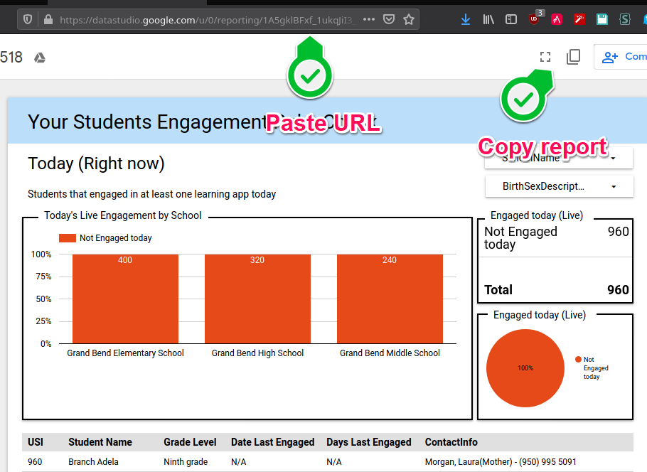

# Ed-Fi-X Student Engagement Tracking and Reports

Remote Learning Student Engagement Tracking and Reports. These reports cover some basic measures to track student engagement during COVID-19 and Remote Learning.

## Overview

This distribution contains a set of tools that enable the tracking of Student's Learning events. Once we have learning events in a data store we create reports to ensure that student engagement is active and consistent.

These scripts are provided as-is, but the Michael and Susan Dell Foundation and the Ed-Fi Alliance welcomes feedback on additions or changes that would make these resources more user-friendly. Feedback is best shared by raising a ticket on the Ed-Fi Tracker [Exchange Contributions Project](https://tracker.ed-fi.org/projects/EXC).

## Limitations

This repository includes a Google Chrome plugin that captures student navigation. The known limitation is that the students will have to use Google Chrome browser.

## Prerequisites

1. MySQL Server 5.6 or higher 
2. MSSQL Server 2017 or higher with Ed-Fi 3.4 database ETL student information data
3. Internet connection to download and install missing dependencies

## Setup Instructions


1. Download the scripts in zip format 
<br/>
2. Unzip them to a known location like C:\temp\edfi\StudentEngegement
<br/>
3. Edit [config.json](./config.json) file to configure properties _StudentLearningEventsConnectionString_ and _EdFiODSConnectionString_ in _BinaryMetadata.ApiBinaries.ConnectionString_
<br/>
4. Open PowerShell as an "Administrator"
<br/>
5. Navigate to the path where you unzipped the scripts
<br/>
6. Execute the following command:

```PowerShell
C:\temp\edfi\StudentEngegement\> .\Install.ps1
```
<br/>
<br/>There will be some warnings if you didn't configure the connection strings in [config.json](./config.json). Then choose the type of installation you wish to use. For the sake of this tutorial we will do "Install everything"

```PowerShell
C:\temp\edfi\StudentEngegement\> ./Install-StudentEngagementTracker
```

<br/>
<br/> At the end a Chrome window will be open to the webapi URL. Chrome will install the plugin from the web store.

## Configure Google Data Studio report
We share a report that can be used as a template. To be able to change the report we need to first create a data source and then make a copy of the report.

### Create data source

1. On Data Studio page click on the _Create_ button
<br/>
2. Click on _Data source_
<br/>
3. Select _MySQL_ connector
<br/>
4. Configure connector
   1. Input server, database name and credentials,
   2. Select report _StudentEngagementReport_ and 
   3. Click on _Connect_
<br/>


### Copy report

1. Paste the report link on the web browser 
2. When the report is open, click on the copy icon
<br/>
3. When asked, select the new data source and click _Copy Report_
<br/>
4. Enjoy


## Production Release Notes (Coming soon).

## Contributing

Looking for an easy way to get started? Search for tickets with label
"up-for-grabs" in Tracker **[Link that text to a pre-existing query for the
project]**; these are nice-to-have but low priority tickets that should not
require in-depth knowledge of the code base and architecture.

## Legal Information

Copyright (c) 2020 Ed-Fi Alliance, LLC and contributors.

Licensed under the [Apache License, Version 2.0](LICENSE) (the "License").

Unless required by applicable law or agreed to in writing, software
distributed under the License is distributed on an "AS IS" BASIS,
WITHOUT WARRANTIES OR CONDITIONS OF ANY KIND, either express or implied.
See the License for the specific language governing permissions and
limitations under the License.

See [NOTICES](NOTICES.md) for additional copyright and license notifications.